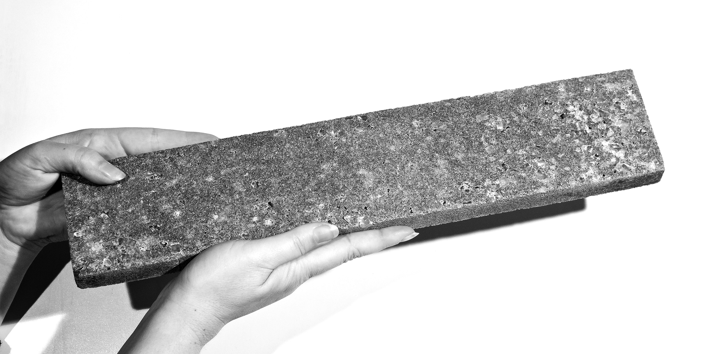
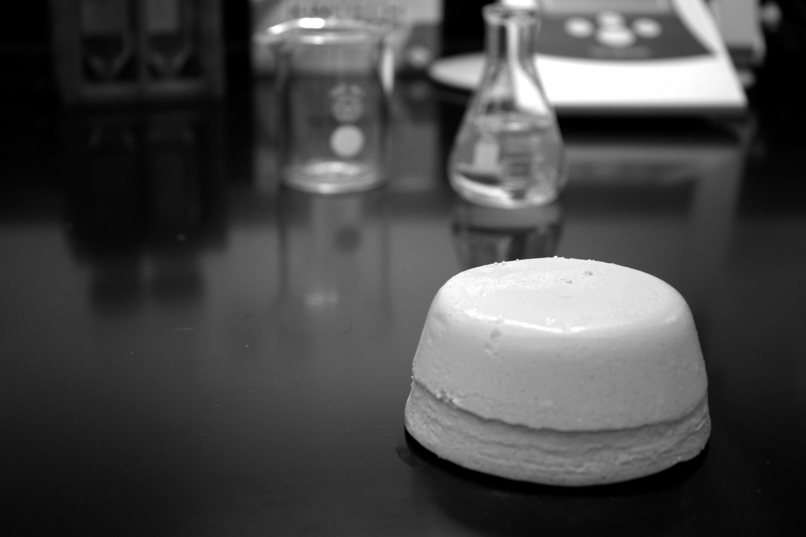

<section class="section-header showcase-header background-light-blue">

# Showcase

<h2 class="header-top-bar"> Making a difference </h2>

We’re not interested in innovation for innovation’s sake — we back technologies that promote the social good. Learn more about our companies’ impact here.

</section>

<section class="usa-section showcase-content background-gray-dark">

### Custom digital voices for those unable to speak

More than ten million people worldwide live with voicelessness. Many of them rely on text-to-speech devices and apps, all of which use the same few generic, mechanical voices to mimic human speech — a solution that’s practical but that diminishes users’ unique vocal identities. **VocaliD** creates custom digital voices by taking a tiny sample of someone’s voice.

To learn more, visit [https://www.vocalid.co/](https://www.vocalid.co/).


for example, a sustained “ah” — and blending it with that of a speaker who is about the same age and size, and who shares a linguistic background with the recipient. Rupal Patel, CEO and founder of VocaliD, says that each merged speech sample creates a unique voice that closely resembles that of the recipient, allowing people to communicate more comfortably.

Dr. Patel recalls getting an email from a nine-year-old who had seen her TED talk and wanted to give her voice to her sister, who was unable to speak. “Getting that email, I thought, ‘this is amazing,’” recalls Patel, who realized that the commercial potential for her technology was vast. Capital from America’s Seed Fund allowed her to scale her company and offer personalized digital voices to people worldwide. Today, VocaliD’s voicebank platform contains more than 20,000 members who have contributed more than 6 million sentences, helping people everywhere preserve their vocal identities.

To learn more, visit [https://www.vocalid.co/](https://www.vocalid.co/).






<iframe title="custom-digital-voices-video" frameborder="0" height="300" width="100%" src="https://www.youtube.com/embed/videoseries?list=PLGhBP1C7iCOkPp8yv2I3ZGk16LiMIiikb" frameborder="0" allowfullscreen></iframe>

</section>

<section class="usa-section showcase-content background-gray-dark">

### Growing bricks with bacteria

More than 80% of global construction uses bricks. Each year, 1.23 trillion bricks are produced, resulting in 800 million tons of carbon emissions, according to **bioMASON**, a small business funded by the America’s Seed Fund.

To learn more, visit [biomason.com](http://biomason.com/).

<!-- bioMASON developed a process to grow bricks with bacteria in hopes of greatly reducing those emissions. They start with water and sand, mix in bacteria, and then feed the bacteria nutrients and chemicals that create a calcium carbonate. This glues the sand together, forming bricks. Unlike traditional brick manufacturing, bioMASON’s method requires no heat, eliminating the capital expenses required by traditional methods.

In addition to funding from America’s Seed Fund, bioMASON has received support from Acorn Investments, Stichting Doen, the North Carolina Biotechnology Center, the Postcode Lottery Green Challenge, North Carolina State University’s Biomanufacturing Training and Education Center, the Cradle to Cradle Products Innovation Institute, and North Carolina State University. -->

<iframe title="growing-bricks-with-bacteria-video" height="300" width="100%" src="https://www.youtube.com/embed/6BqoM4am8kw" frameborder="0" allowfullscreen></iframe>

<!-- 

 -->

</section>

<section class="usa-section showcase-content background-gray-dark">

### Making plastics conductive

**PolyDrop** CEO Volha Hrechka wants to “complete the plastics revolution” by making plastics more conductive. Her company’s revolutionary product has its roots in the aerospace industry. “The Boeing 787 Dreamliner is 70% carbon-fiber composites,” Hrechka said, “but these don’t conduct electricity.” This poses efficiency and safety issues; excess static-charge buildup in planes can interfere with sensitive electronics and navigation systems. Making plastics conductive will make planes lighter and extend the functionality of those plastics, ultimately reducing costs and potentially saving lives.

To learn more, visit [http://www.polydrop.net/](http://www.polydrop.net/).

<!-- PolyDrop’s conductive polymer additive is useful to industries beyond aerospace; it has also been used for coatings, composites, batteries, marine vessels, textiles, flooring, and electronics.

Hrechka cites America’s Seed Fund as the reason her technology has made its way to market. Scale-up testing is crucial in the material sciences field, and angel investors can be hard to come by. The seed fund “has had a tremendous impact for our company,” Hrechka has said.

To learn more, visit [http://www.polydrop.net/](http://www.polydrop.net/). -->

<iframe title="making-plastics-conductive-video" height="300" width="100%" src="https://www.youtube.com/embed/wcUj-jIynHs" frameborder="0" allowfullscreen></iframe>

<!-- 

 -->

</section>

<section class="usa-section showcase-content background-gray-dark">

### Sustainable synthetic bait

Each year, commercial crustacean fishing outfits spend nearly $20 billion on forage (bait) fish. The costs incurred aren’t just monetary, however. Bait fish usage in this sector could lead to overfishing and depletion of forage fish species, which may, in turn, harm other animal populations. **Kepley Biosystems** hopes to reduce these harms.

To learn more, visit [http://kepleybiosystems.com/organobait/](http://kepleybiosystems.com/organobait/).

<!-- Kepley Biosystems’ OrganoBait — a fully synthetic bait — mimics the scent of forage fish to attract lobsters and crabs. Because it’s fish-free, its cost doesn’t fluctuate as forage fish populations do and it’s available year-round, which benefits commercial fisheries. And because it reduces demand for actual forage fish, it can make crustacean fishing more sustainable and help protect remaining forage fish populations, benefiting the animals that feed on them.

Using Phase I funding, Kepley Biosystems was able to define their product and identify the chemotactic cues that crabs and lobsters respond to; armed with this knowledge, the company was able to create a synthetic alternative. They used Phase II funding to test their product’s market capacity and test OrganoBait in real-world conditions. Early testing has shown OrganoBait’s effectiveness and flexibility in different fishing conditions to be highly successful.

To learn more, visit [http://kepleybiosystems.com/organobait/](http://kepleybiosystems.com/organobait/). -->

<iframe title="sustainable-synthetic-bait-video" width="100%" height="300" src="https://www.youtube.com/embed/aszA1FM6nL4" frameborder="0" allowfullscreen></iframe>

<!-- 

 -->

</section>
